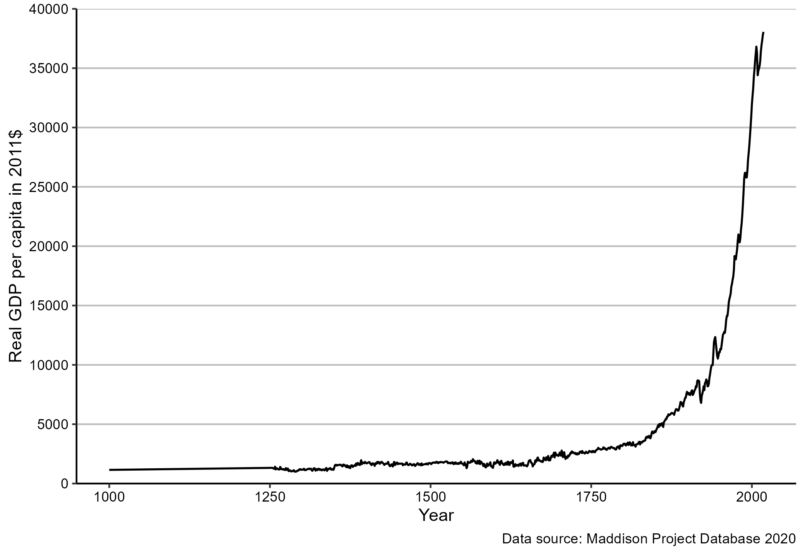

# Introduction 

#### A first look at  data  {-}

Figure \@ref(fig:fig1) shows a line chart of annual levels of economic activity per person in the United Kingdom based on data from the Maddison Project Database (MPD) 2018. 

(\#fig:fig1)GDP per capita in the United Kingdom. Source: Maddison Project Database (MPD) 2018.

The chart is a good illustration of the core topics of this book:

1. **What is the chart showing?** The chart shows economic activity per person measured as the Gross Domestic Product (also known as GDP) per person. But what is the GDP? Is the number of persons in the United Kingdom measured at the beginning or the end of the year? We cover definitions of economic data concepts such as GDP, unemployment, and prices in part I.

2. **Where does the data come from?** We know that the data source for Figure \@ref(fig:fig1) is the  Maddison Project Database (MPD) 2018, but where do they get the data from? How can we download the data to create our own chart? We will cover data basics in part II.

3. **Why did we use a chart?**  The chart is known as the "History’s hockey stick," because the line chart has the shape of a hockey stick. The hockey stick shape is all that we want the reader to remember, because it represents the overall long term trend. If we wanted to reader to remember a precise value, we would have used a table like the one shown in Figure  \@ref(fig:fig2). 

(\#fig:fig2)GDP per capita in the United Kingdom. Source: Maddison Project Database (MPD) 2018.

However, this table does a poor job in communicating the overall trend. How do we know whether to use a table or a chart? How do we design a table or chart? We will cover basic data visualisation techniques in part II.
