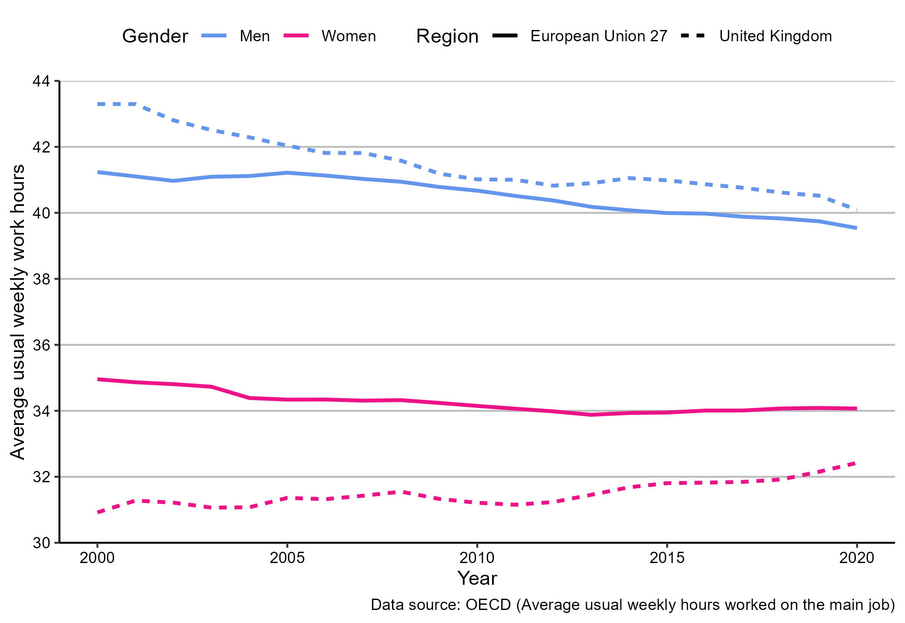

# The labour market

## What this chapter is about

This chapter is about the labour market. We start with a description of how we can divide the population into groups according to economic activity. We discuss how we define employment and unemployment and two ways of measuring  unemployment rates. We will also  discuss the difference between the intensive and extensive margin of labour supply and briefly describe how we can quantify the demand side of the labour market and create a graphical representation of the matching efficiency in the labour market by means of the Beveridge curve.

After reading this chapter you should be able to 

* Explain and apply definitions of unemployment rates:
  * The survey based measure of unemployment.
  * The register based measure of unemployment.
* Explain the difference between the  extensive and intensive margin of labour supply.
* Create data visualizations of labour demand and the Beveridge curve. 

## From  population data to the labour market 

We can divide the total population into groups according to their *economic activity*. For economic analyses it is often useful to split the population into three groups by their age. 

1. Children
2. Elderly
3. Working age population

This distinction is used in most countries, but the exact definitions of groups vary from country to country. One reason for the variation in  definitions is that they are linked to the institutional setting. The definition of what  ages  are defined as "children" will typically depend on the formal compulsory minimum school leaving age. The definition of what ages to include as the elderly will typically depend on the retirement policies.

Using the data from Eurostat, Figure \@ref(fig:labour1) shows a stacked area chart of the population stock for the United Kingdom since 1970, split by age group. We observe that the working age population is by far the largest group. At the beginning of the period the group of children were clearly larger than the group of elderly, but at the end of the period the two groups have quite similar sizes. 

(\#fig:labour1)Grouping the population of the United Kingdom by age group. Data source: Eurostat. 

Within the working age population we can further split the population into

* In the labour force.
* Out of the labour force

Where out of the labour force consists of the following:

* Students
* Long-term sick
* Looking after family/staying home
* Retired
* Other

Let's now focus on the labour force.The labour force consists of the following two groups:

* People who are unemployed
* People who are employed (including self-employed)

The box below summarises the break-down of the population from the full population to the labour force. 

<strong>From the population to the labour force</strong>

The full population can be divided into

1 Children (UK definition: Aged below 16)

2 Elderly (UK definition: Aged above 64)

3 Working age population which consists of

<ul>
<li>
Out of the Labour Force

<ul>
<li>Students</li>
<li>Long-term sick</li>
<li>Looking after family/staying home</li>
<li>Retired</li>
<li>Other</li>
</ul></li>
<li>
In the labour force

<ul>
<li>People who are unemployed</li>
<li>People who are employed (including self-employed)</li>
</ul></li>
</ul>

 

We will now take a closer look at the labour force by defining the categories in the labour force. 

## The labour force

### Unemployment {-}

#### Who is unemployed? {-}

While most people have an idea about what unemployment is, the exact definition of unemployment is considerably less well known. Who is unemployed? Are retired people defined as  unemployed? Are children defined as unemployed? Most people would probably say no to these questions. But there are more complex groups: Are students defined as  unemployed if they don't work? Are parents on parental leave defined as  unemployed? Am I defined as unemployed if I decide not to work? The answer to all these questions is "no". 

Most countries and international statistics follow the  definition of unemployment specified by the International Labour Organisation (ILO). According to the ILO definition, unemployed is being

* "without a job, have been actively seeking work in the past four weeks and are available to start work in the next two weeks".
* "out of work, have found a job and are waiting to start it in the next two weeks".

This definition is used by the European Union (Eurostat),  by the Organisation for Economic Cooperation and Development (OECD) and many national statistical offices (including the Office for National Statistics in the United Kingdom). But how do we get data on  the questions above? The solution is *survey data*. For the United Kingdom we obtain data on unemployment from the Labour Force Survey (LFS). The LFS is conducted by the Office for National Statistics by selecting random households from the   Royal Mail's Postcode Address File. Once households are selected to participate in the survey, they are contacted and asked whether *"they are without a job, have been actively seeking work..."* and so on. This data is then included in the official unemployment numbers. 

#### An internationally coherent definition of unemployment {-}

All European Union member states  are obliged to run labour force surveys on at least an annual basis. For the United Kingdom, the survey has been quarterly since 1992. The Office for National Statistics also releases monthly data, although this is not included in the official statistics. 

The **ILO unemployment definition** above is also called the **survey measure of unemployment**. This name is based on the fact that the most common alternative measure of unemployment is based on **register data** from administrative records. ***Registered unemployment is measured by using data on the number of benefit claimants**. Instead of asking people whether they are looking for a job and not working, we assume that people that claim benefits are unemployed. Statistical offices typically release both measures of unemployment. The register and survey based measures of unemployment  typically deviate substantially because: 

* People might be looking for jobs even if they don't claim benefits because they are not eligible for benefits.
* People might be claiming benefits without looking for jobs.

<strong>Measuring unemployment: Two definitions</strong>

<em>1. The survey based measure of unemployment (also known as the
ILO definition).</em>

<ul>
<li>
Based on surveys of random subsamples of the population.
</li>
<li>
People are defined as unemployed if they are

<ul>
<li>without a job, have been actively seeking work in the past four
weeks and are available to start work in the next two weeks</li>
<li>out of work, have found a job and are waiting to start it in the
next two weeks</li>
</ul></li>
</ul>

<em>2. The register based measure of unemployment.</em>

<ul>
<li>Based on administrative registers of benefit claimants.
<ul>
<li>How many individuals received unemployment benefits.</li>
</ul></li>
</ul>

Let's now look at the other part of the labour force. The employed. 

### Employment  {-}

#### An internationally coherent definition of employment {-}

Just like unemployment, measuring employment is not straightforward and the ILO has specified a definition, which the Office for National Statistics applies in the LFS. Following this definition people are employed if they are above 16 and satisfy one of the following conditions:

*  work at least one hour for pay in a week, people who are temporarily away from jobs.
* are on Government-supported training/employment programs.
* do unpaid family work. 
  
 Paid work refers  to both employees and self-employed, and unpaid family work refers to working for family businesses without receiving a formal wage, but still benefiting from the business. 

 It is important to note that employment is not the same as jobs. Employment measures refer to people, and people with several jobs will only be counted once in the employment statistics. In the job statistics, each job is counted. 

Like with unemployment, we can also compute register based measures of employment by using information from income tax payments, insurance status and other administrative registers.

<strong>Measuring employment: Two definitions</strong>

<em>1. The survey based measure of employment.</em>

<ul>
<li>work at least one hour for pay in a week, people who are temporarily
away from jobs.</li>
<li>are on Government-supported training/employment programs.</li>
<li>do unpaid family work.</li>
</ul>

<em>2. The register based measure of employment.</em>

<ul>
<li>information from income tax payments, insurance status and other
administrative registers.</li>
</ul>

### The unemployment rate {-}

Having defined who is unemployed and who is employed it is straightforward to define the labour force. The labour force is simply the sum of these two groups:

\begin{align}
  \text{Labour force}=Unemployed+Employed
\end{align}

We are now ready to  calculate the unemployment rate. The unemployment rate is the fraction of the labour force that is unemployed:

\begin{align}
  \text{Unemployment rate}&=\frac{Unemployed}{\text{Labour force}}\nonumber\\
  &=\frac{Unemployed}{Unemployed+Employed}
\end{align}

How can the unemployment rate change?  If people move from unemployment to employment, the unemployment rate clearly goes down, as the size of the denominator is unchanged and the size of the numerator is reduced. Vice versa if people move from employment to unemployment.

What happens to the unemployment rate if people move from unemployment to out of the labour force? The unemployment rate will go down, everything else equal, because the numerator is increased by relatively more than the numerator. Vice versa if people go from out of the labour force to unemployment.

#### An illustration using data for the United Kingdom {-}

Figure \@ref(fig:labour2) shows the unemployment rate for the United Kingdom using both measures. As you can see, for the period considered, the registered unemployment rate is always lower than the survey based measure of unemployment. Why do you think this is the case? And why is the difference not constant over time?

(\#fig:labour2)The unemployment rate in the United Kingdom, using two different measures of unemployment. Data source: OECD 

Recall that the register based unemployment is based on the number of people receiving benefits. However not everyone who is looking for a job is necessarily eligible for unemployment benefits. In that case the survey based unemployment rate will be higher than the register based. On the other hand some people who receive benefits might not be actively looking for jobs. In that case the survey based unemployment measure will be lower. Whether the former or latter dominates partly depends on the institutional setting. Who is eligible for benefits and who is not. That is also one reason  why the difference between the two lines might change over time. It can be because benefit policies change. It could also be because economic conditions change, and the composition of job seekers changes.

### Out of the labour force

In the United Kingdom, the labour force is about half of the population (about 33 out of 66 million). What about the rest? First, we've already covered  children and individuals aged above 64. But then there are still about 8.9 million people left, where did they go? This group is called economically inactive by the Office for National Statistics. We covered them in the box above. They include students, long-term sick and people who decide not to work. Personally I am not a big fan of calling them economically inactive, but that is the definition. The Office for National Statistics also calculates  inactivity rate is defined as follows:

\begin{align}
  \text{Inactive rate}=\frac{\text{Number of people aged 16 to 64 not in work/ available for work}}{\text{All people aged 16 to 64}}
\end{align}

So what do the "economically inactive" people do (or people who are not in the labour force, as I prefer to call them)? In the UK, the distribution of economically inactive is approximately as follows:

* 27 percent are studying.
* 24 percent are looking after the family/staying home.
* 23 percent are long-term sick.
* 13  percent are retired.

Now that we have divided the population into groups according to their economic activity, we are ready to create graphs and tables on unemployment rate, employment rates and inactivity rates. 

<strong>How to reduce the unemployment rates</strong>

Imagine that you are working for a newly elected prime minister, and
the prime minister promised to lower unemployment rates, how could you
achieve this?

<ul>
<li>
Abandon the survey based measure of unemployment (the ILO
measure), and only use the register based measure, because the latter
tends to be lower.
</li>
<li>
Tighten the criteria for receiving unemployment benefits, as this
will make less people receive benefits, which will lower the register
based unemployment measure.
</li>
<li>
Introduce “leave” policies that allow unemployed workers to be
“on leave” instead of unemployment. This will move people out of the
unemployment category.
</li>
</ul>

<em>Are these policies good?</em>

<ul>
<li>There might be normative arguments against and for these policies,
but it is importantly: the immediate reduction in unemployment is caused
by relabeling (or classification) of people, not by changing their
actual situation.</li>
<li>(it might be that labeling people as “unemployed” or a leave policy
affects the unemployment rate beyond the pure relabeling effect).</li>
</ul>

### labour supply: Extensive vs. intensive margin {-}

#### What about the intensive margin? {-}

So far we have only discussed  whether people are working or not. This is called the **extensive margin** of the labour supply.

However,  labour supply is both a function of whether people work, and *how much* they work. The former is called the *extensive margin*, and the latter is called the *intensive margin*.  The extensive margin is typically a binary variable (to work or not), while the intensive margin is a continuous variable (how many minutes or hours of work). In the section about people we saw how we could decompose changes in live births in changes in the general fertility rates and changes in the number of of women in childbearing ages. We could now use the same approach to decompose changes in labour supply in changes in how many people work, and changes in how many hours people on average work.

#### Policy relevance of the intensive margin  {-}

The distinction between extensive and intensive margin is important in many policy discussions. For example if we adjust tax policies, we might be interested in how it affects people's decision to join the labour market (the extensive margin) and people's decision on how much to work (the intensive margin).

#### Measuring labour supply on the intensive  margin?  {-}

Measuring variation in intensive labour supply is slightly more challenging than  measuring the extensive margin. I know that I work, but I have no precise idea about how many hours I work.  For the United Kingdom, data on hours worked also comes from the Labour Force Survey. The Office for National Statistics makes the distinction between actual hours worked, average hours worked and the usual hours worked. They key difference is whether the measure is affected by absence (due to sickness or holiday).

#### Measuring labour supply: An illustration using hours worked  {-}

In Figure \@ref(fig:labour3)) we show the average weekly hours in the United Kingdom by gender compared to the European Union. The first observation we can make is that women have lower weekly hours than men. The second observation is that while the  average weekly hours of men in the United Kingdom is  slightly higher than  the European Union 28 average, the average weekly hours of women is lower in the United Kingdom compared to the European Union 28. 

(\#fig:labour3)The intensive margin of labour supply: weekly hours worked in United Kingdom and the European Union 28. Data source: OECD. 

## Labour demand

### Measuring labour demand {-}

So far we only discussed the supply side of the labour market. The size of the labour force captures the potential supply of labour in an economy. But what about the demand side? How much labour is demanded in the economy? Measuring the demand size is challenging and considerably less standardized compared to the supply size. Just like for the labour supply side, there are two different sources of labour demand measures: 

* Register based measures of labour demand: Using data from public employment services we can use the number of announced job vacancies as an indicator for labour demand.
* Survey based measures: we can ask firms about their labour demand needs.

#### Advantages and disadvantages {-}

The two labour demand measures above each have their own advantages and disadvantages. The register based measure is  considerably cheaper and tends to exist for longer periods and in more countries. However, not all firms post their vacancies in the public employment service, so the sample of vacancies might not be representative of the actual number of vacancies. Moreover, the use of traditional job vacancy posting has changed over time, so this measure might be less representative today compared to what it used to be. 

The survey based measure of vacancies on the other hand is more expensive and suffers from the "usual" survey issues: not every firm responds and maybe the firms that respond are not representative. But compared to the register based measure, the "non-representativeness" might be less of a worry, although empirical evidence on this issue is not clear. As mentioned, the survey-based measure of job vacancies is less standardized than the survey-based measure of unemployment, but international organizations collect data on job vacancies and attempt to unify the definitions of job vacancies. The definition provided by Eurostat is as follows:

<strong>The Eurostat definition of a job vacancy</strong>

According to the Eurostat job vacancy statistics a ‘vacancy’ is
defined as a paid post that is newly created, unoccupied, or about to
become vacant:

<ul>
<li>for which the employer is taking active steps and is prepared to
take further steps to find a suitable candidate from outside the
enterprise concerned; and</li>
<li>which the employer intends to fill either immediately or within a
specific period of time.</li>
</ul>

#### The job vacancy rate {-}
We can relate the number of vacancies to the size of the labour force to obtain a measure of the job vacancy rate. While this is the typically textbook measure of the job vacancy rate, statistical databases often provide slightly different measures. Eurostat defines the job vacancy rate as follows:

\begin{align}
  \text{JVR}_{\text{Eurostat}}=\frac{\text{number of vacancies}}{\text{number of occupied posts}+\text{number of vacancies}}\times 100
\end{align}

If we are willing to  approximate the number of occupied posts by the number of employed people, the main difference between these two definitions of the job vacancy rate is whether we include vacancies or unemployment in the denominator. Both measures are commonly used, but it is of course important to be consistent when comparing job vacancy rates across regions and time. A reduction in vacancies will lead to a smaller reduction in the job vacancy rate using the Eurostat definition than the definition above, because in the latter it only affects the numerator.

## Supply meets demand 

We can combine our measures of labour supply and demand to create the Beveridge Curve, which is named after its "inventor", the English economist William Beveridge. The Beveridge curve shows the job vacancy rate on the vertical axis against the unemployment rate on the horizontal axis.  The Beveridge curve is a simple indicator of the matching efficiency of the labour market. Without any frictions and in the simple economic model, the line should only "exist" on the axes: We should only have a positive job vacancy rate if unemployment is zero, and we should only have unemployment if we have no vacancies. In practice, this is clearly not the case as Figure \@ref(fig:labour4) shows. We have unemployment and vacancies at the same time. How can that be and how does that say something about the labour market?

* The unemployed worker and the vacancy haven't "matched" yet: search frictions and other difficulties mean that even if there is a suitable unemployed candidate, the open position might not be filled immediately. There is an application deadline, formal procedures and the unemployed first has to find the job.
* An outward shift in the Beveridge curve (as illustrated) suggests a reduction in the matching efficiency of the labour market: For a given number of vacancies in the economy, we have a higher unemployment rate. 
* However, there are other reasons for shifts in the labour market than pure search frictions. 

* The assumptions of a homogeneous labour market are very simplified.
* There might be vacancies in Manchester and the unemployed in London (geographical mismatch)
* There might be firms looking for lawyers, but only unemployed economists (skill mis-match).
*  and so on.

(\#fig:labour4)The Beveridge curve for the United Kingdom. Data source: OECD. 

## Further readings

* [The International Labour Organisation's definition on the unemployment rate.](https://www.ilo.org/ilostat-files/Documents/description_UR_EN.pdf) 

*  [OECD's Unemployment rate definitions](https://data.oecd.org/unemp/unemployment-rate.htm)

* [Eurostat about Job Vacancies](https://ec.europa.eu/eurostat/cache/metadata/en/jvs_esms.htm)

